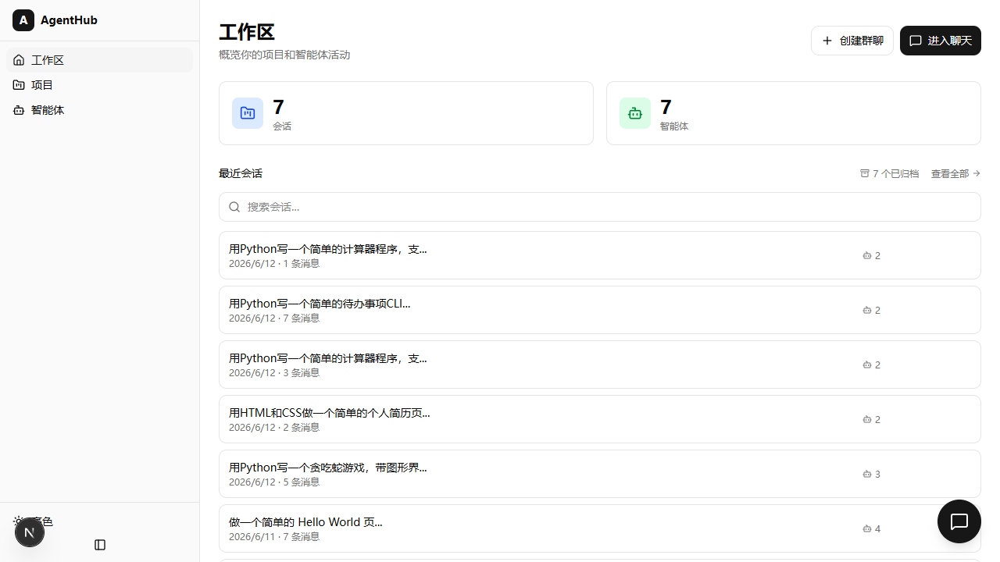
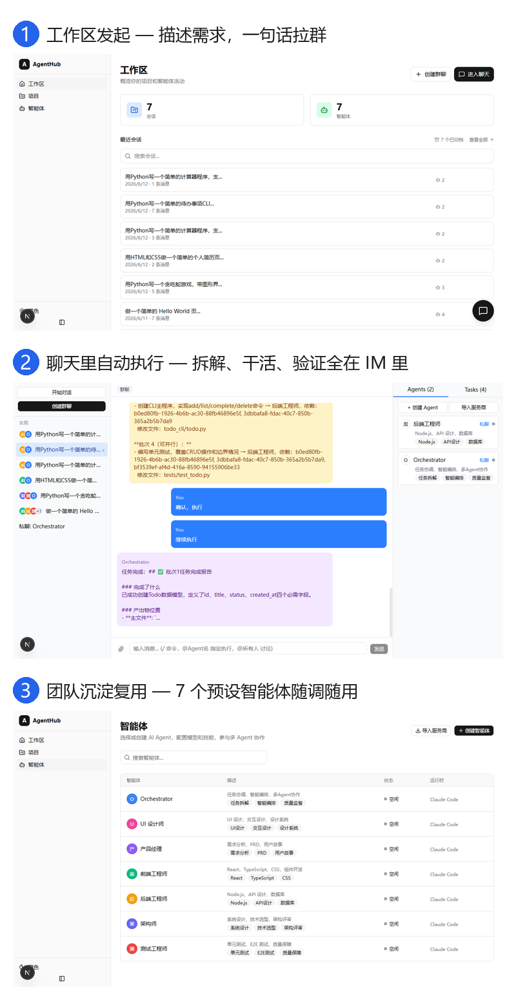
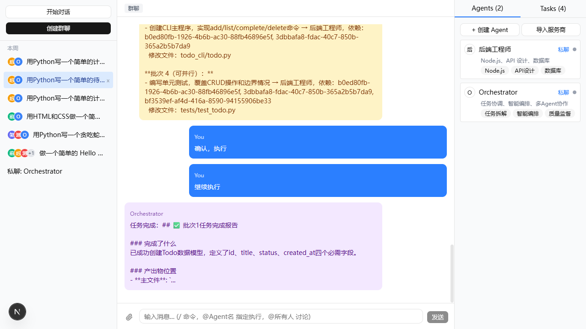
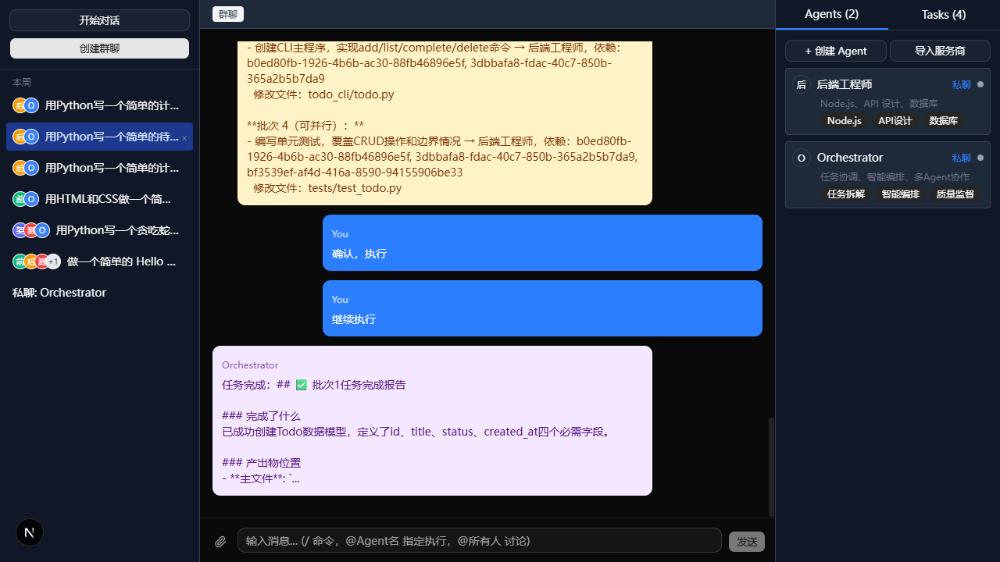
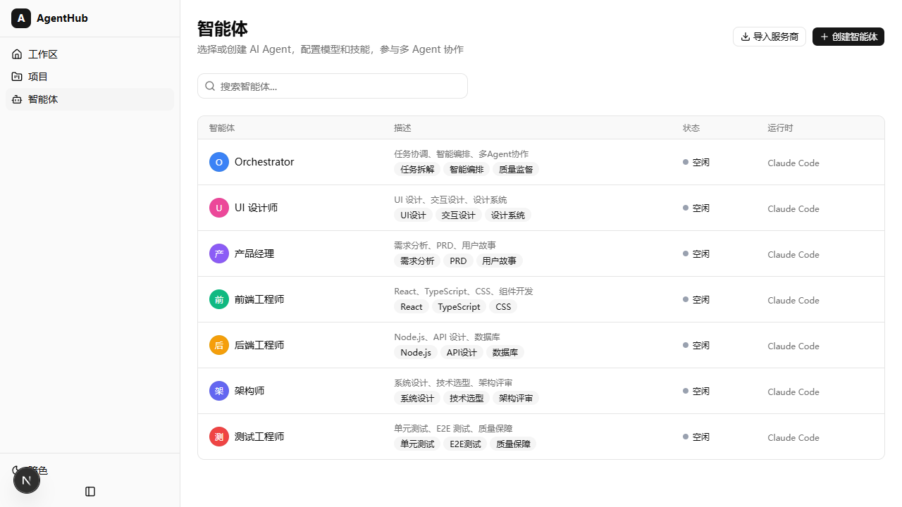
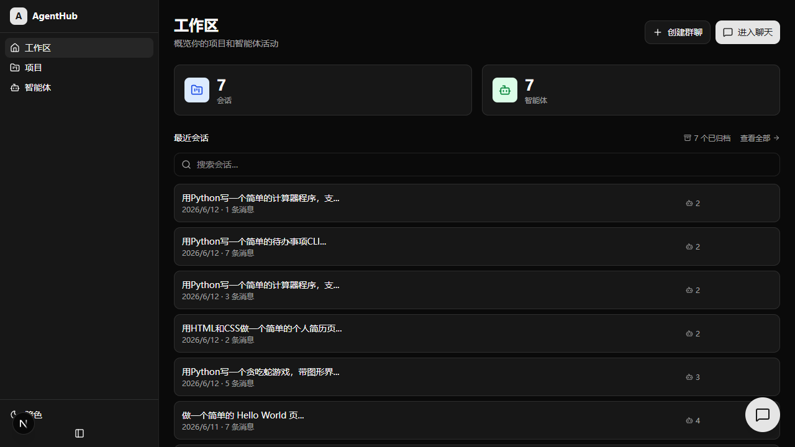

<div align="center">

# AgentHub

**IM 风格的多 Agent 协作平台** — 在聊天里拉起一支 AI 团队，Orchestrator 负责选人、拆任务、监督、纠偏。

[](https://github.com/hhhhhhh520/agenthub)
[](LICENSE)
[](package.json)
[](tests/)
[](https://nextjs.org)
[](https://www.typescriptlang.org)
[](https://www.prisma.io)



**60 秒看懂它在干什么：**



</div>

## ✨ 设计亮点

- **Orchestrator 9-action 状态机** — self/delegate/discuss/align\_\*/execute/verify/done 编排闭环；对齐流程学习人类团队“先对齐再干活”（PM 确认需求 → 架构师拆解任务 → Agent 提问澄清）
- **执行层强制验证** — 代码任务拆解后自动追加 verify 任务（纯 prompt 引导被证明无效，改执行层强制），多轮对齐自动扩展验证覆盖，代码完成自动触发验证
- **Contract v1 契约化协作** — `<authoritative_input>` 权威注入 + declaredFiles 分级越界校验 + outputSchema 结构校验，三契约管住 LLM 的不可靠性
- **会话锁 fail-closed** — 同一会话串行执行，等锁超时回 429 绝不并发写状态，杜绝 phase 写入竞态
- **进程池 + 配置指纹** — 每（会话，Agent，配置）独立 CLI 进程，配置 hash 隔离，10 分钟空闲回收，优雅关闭
- **双 CLI 适配层** — Claude Code + OpenCode 统一抽象，spawn 子进程 + NDJSON 流式解析，工具白名单硬限制
- **测试质量方法论** — 1103 单元测试 + 每次修复配“真回归守卫”（回退修复测试必红）+ 变异验证（删掉修复测试必红）

## 💬 功能

- **三栏 IM 布局** — 会话列表 | 聊天区 | Agent 面板
- **拉群流程** — 描述任务 → AI 推荐 Agent → 用户增减 → 确认建群
- **三种会话** — Orchestrator 主会话 | 群聊（多 Agent 协作）| 私聊（1v1）
- **对齐流程** — PM 确认需求 → 架构师确认技术方案+任务拆解 → 其他 Agent 提问（拆解失败 3 次硬停转人工，不无限弹跳）
- **Agent 预设池** — 7 个预设 Agent（架构师/前后端/测试/PM/设计师/Orchestrator），全局复用
- **多供应商** — 每个 Agent 可独立配置 model/baseUrl/apiKey，支持 CC-Switch 导入
- **混合执行层** — Claude Code CLI / OpenCode CLI 双平台
- **工具集硬限制** — Agent 工具白名单通过 CLI 参数（Claude Code）和配置文件（OpenCode）硬限制
- **SSE 流式** — 实时推送 Agent 输出
- **消息操作** — 回复引用、重新生成、复制代码、操作菜单
- **@ 提及** — 输入 @ 弹出成员列表，快速指定 Agent 或 @所有人讨论
- **产物内联** — 代码块、Web 预览、文件卡片、Diff 视图（Accept/Reject）
- **工作区与权限** — 用户指定项目目录，Agent 直接在项目中工作，权限模式（default/auto）
- **变更检测** — 每批任务执行后 Git diff 检测越界修改
- **任务重做** — 失败/阻塞任务可编辑描述后重新执行，自动级联下游任务
- **暗色模式** — 支持亮色/暗色/跟随系统

## 📸 截图

| 亮色模式 | 暗色模式 |
|----------|----------|
|  |  |
|  |  |

## 🚀 快速开始

**前置条件：** Node.js 18+，至少安装一个 AI CLI 平台：
- [Claude Code CLI](https://docs.anthropic.com/en/docs/claude-code)（`npm install -g @anthropic-ai/claude-code`）
- [OpenCode CLI](https://open-code.ai)（`npm install -g opencode`）

```bash
# 克隆项目
git clone https://github.com/hhhhhhh520/agenthub.git
cd agenthub

# 安装依赖
npm install

# 初始化数据库
npx prisma db push

# 填充预设数据（7个Agent）
npx tsx prisma/seed.ts

# 启动开发服务器
npm run dev
```

打开 http://localhost:3000，首次启动会进入 Setup Wizard 引导你配置 CLI 平台和 Agent。

> 首次启动需要执行全部步骤。后续启动只需 `npm run dev`。

> ⚠️ **安全提示**：本项目 API 无认证（决策记录见 [docs/design/roadmap-to-excellence.md](docs/design/roadmap-to-excellence.md) §8#1）。`npm run dev` 已绑定 `127.0.0.1`（仅本机可访问），请用 `http://localhost:3000` 打开；**不要在上锁前把服务暴露到公网或局域网**（如需远程访问，先补认证）。

## 🏗 架构

```
用户浏览器
  ↓
Next.js App (SSE 流式推送)
  ├── Orchestrator（编排器）
  │     ├── 对齐流程: PM确认 → 架构师拆解 → Agent提问
  │     ├── 9 种 action: self / delegate / discuss / align_* / execute / verify / done
  │     └── 执行循环: DAG分批 → 越界检测 → 自动验证(verify) → 监督纠偏
  ├── Contract v1（Agent 间数据契约）
  │     ├── authoritative_input 权威注入（数据流）
  │     ├── declaredFiles 分级校验 + outputSchema 软校验（可信度）
  │     └── cliSessionId 连续性护栏
  ├── 会话锁（session-lock）
  │     └── 同一会话串行执行，超时 fail-closed 回 429，杜绝 phase 并发写
  ├── Adapter 层
  │     ├── Claude Code Adapter（spawn CLI，读 NDJSON）
  │     └── OpenCode Adapter（spawn CLI，读 NDJSON）
  └── MCP Server（Agent 间共享工具，执行阶段注入）
```

## 🛠 技术栈

- Next.js 16 (App Router)
- TypeScript
- TailwindCSS 4 + shadcn/ui
- Prisma 7 + SQLite
- Monaco Editor
- Claude Code CLI + OpenCode CLI

## 🧪 测试

```bash
# 运行全部单元测试（含覆盖率报告）
npm test

# 运行 E2E 测试(默认 skip,需 MIMO_TEST_API_KEY 环境变量)
E2E=1 npm run test:e2e
```

测试现状（2026-09-20）：1103 passed / 3 skipped；覆盖率（2026-08-07 重测）：Statements 83% / Branches 76% / Functions 81% / Lines 84%

## 🗺 路线

- [x] 显式状态机 + 决策轨迹 + 受控实验（A 方向收官）
- [x] 任务板轮询退避、会话锁 fail-closed、replan 硬停、多轮 verify（09-13 缺陷清扫）
- [ ] seqgate 转正（等启动条件：可分析会话 ≥ 20 且 gate 命中 ≥ 5）
- [ ] 降级能力检查（需备用模型配置）
- [ ] SaaS 化：多用户隔离、安全与质量清扫重评

## 📚 文档

- [Agent 协作 Contract v1](docs/discussions/agenthub-contract-v1.md) — 核心协作契约(数据流/可信度/连续性三条)
- [v2 设计决策](docs/design/agenthub-v2-design-decisions.md) — 当前架构设计
- [对齐流程实现](docs/design/alignment-flow-plan.md) — Orchestrator 智能编排实现计划
- [已实施方案](docs/archive/已实施/) — CLI-first 改造、ChatFab 私聊、SSE 超时等
- [参考报告](docs/archive/参考报告/) — AI 协作流程、多 Agent 架构对比
- [开发问题记录](issues/) — 已解决问题和设计验收清单

## 🤝 贡献

欢迎贡献！请查看 [CONTRIBUTING.md](CONTRIBUTING.md) 了解开发流程和提交规范。

## 📄 许可证

[MIT License](LICENSE)
